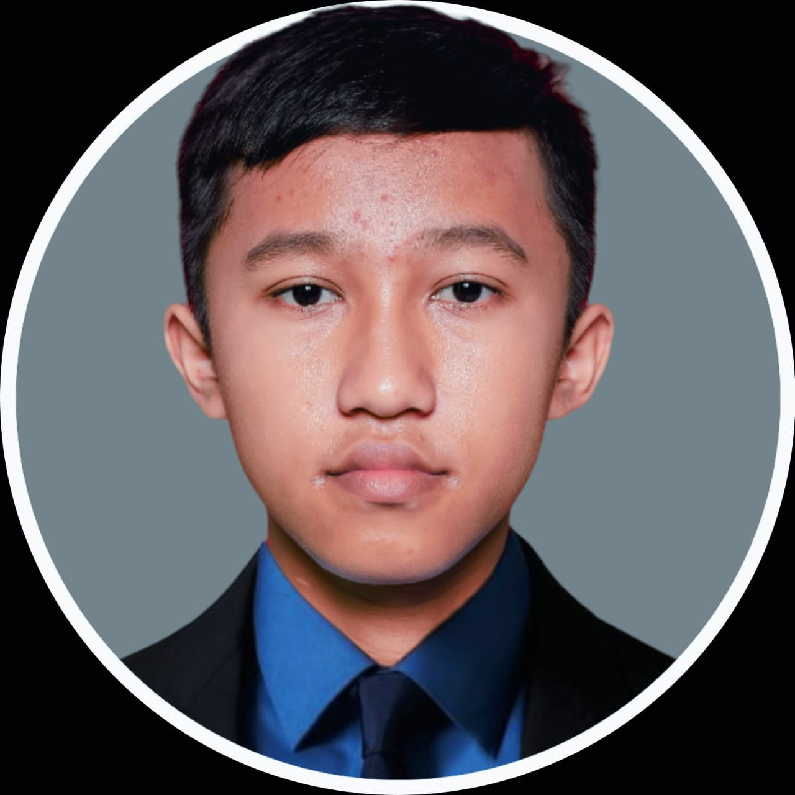

# web_profil.github.io
<!DOCTYPE html>
<html lang="id">
<head>
    <meta charset="UTF-8">
    <meta name="viewport" content="width=device-width, initial-scale=1.0">
    <title>Profile</title>
    
<body>
    <nav class="container">
        

            

                PROFIL
            

            <ul>
                <li><a href="#Tentang-Saya">Tentang Saya</a></li>
                <li><a href="#Kegemaran">Kegemaran</a></li>
                <li><a href="#Keseharian">Keseharian</a></li>
            </ul>
        

    </nav>
    <section class="color" id="Tentang-Saya">
    <aside class="deskripsi">
        <h1>Hi,Nama Saya   AHMAD SYARIFUDIN YUSUF</h1>
        
Saya adalah seorang Siswa SMK Negeri 1 Doko yang mengambil  
        bidang studi keahlian Teknik Komputer Jaringan dan Tekominikasi (TKJT)  

        

            
Bakat saya ialah Menggambar dengan pensil. saya mulai menggambar
                dengan membuat sketsa gambar kemudian saya memberi garis yang tebal.  
                Agar gambar menjadi realistis saya mengunakan teknik 
                 arsir dan blending. 

                 
Saya berminat untuk dengan hal yang berbau teknologi
                    itulah mengapa saya belajar bahasa pemrogaman 

        

    </aside>
        
    </section>
    <section class="color Kegemaran" id="Kegemaran">
        <h3 class="title">KEGEMARAN</h3>
        

            

                <h4>Menonton film & Series</h4>
                
Dari kisah-kisah epik yang memikat hati hingga karakter-karakter yang mendebarkan, serial film memanjakan penggemarnya dengan beragam emosi dan petualangan yang tak terduga.

            

            

                <h4>Bermain Game Setrategi</h4>
                
Bermain game strategi tidak hanya menghibur, tetapi juga mengasah pikiran. 
                Dalam dunia virtual yang penuh tantangan, pemain diajak untuk merencanakan,
                 mengambil keputusan, dan menyesuaikan strategi dalam waktu yang singkat. Ini adalah latihan mental yang sempurna yang memperkuat kemampuan analitis dan pemecahan masalah.

            

            

                <h4>Belajar Hal baru</h4>
                
Belajar hal baru adalah proses yang tak pernah berakhir dan merupakan
                     bagian penting dari pertumbuhan pribadi. Dengan belajar, kita tidak hanya
                      meningkatkan diri kita sendiri, tetapi juga meningkatkan potensi kita untuk memberikan
                       kontribusi positif kepada masyarakat.

        

         

    </section>
        

        

        <article class="Keseharian" id="Keseharian">
        <h3>KESEHARIAN</h3>
            
Saya biasanya memulai aktivitas dengan bangun tidur kemudian mengambil air wudhu untuk
            salat subuh. Kemudian saya mulai mandi, memakai seragam, dan menyiapkan apa saja yang 
            perlu dibawa kesekolah pada pukul 05.15 dan setelah itu saya berangkat sekitar pukul 06.00.
            Sesampainya di sekolah biasanya saya meletakkan tas di bangku menegah atau agak depan.  
            Saat waktu jam Pembelajaran saya mengikuti sesuai dengan jadwal seperti yang sudah di
            jadwalkan. Saya berusaha untuk meraih nilai sebaik mungkin walaupun terkadang hasilnya 
            tidak sesuai 
            dengan apa yang saya inginkan. Pada saat istirahat saya biasanya membeli makanan dan minuman.
            Dan di istirahat kedua saya melaksanakan salat dzuhur di awal waktu.

            
Saya pulang pada pukul 15.20 dan sampai dirumah pada pukul lebih 16.00. Saat pulang
            seko>lah dirumah saya beristirahat sejenak. Setelah itu pada waktu sore saya mandi 
            kemudian mendirika  salat ashar. Kemudian say pergi kemasjid untuk melaksanakan salat 
            maghrib. Setelah itu saya biasanya mengaji sembari menuggu waktu isyak tiba. Saya pulang 
            setelah melaksanakan salat isyak dan kemudian saya mengerjakan PR dirumah dan saya tidur 
            pukul 21.30.

            
Pada setiap sabtu biasanya saya menyempatkan waktu untuk ikut klub Bahasa inggris untuk 
            melatih kemampuan Bahasa inggris saya yang dimana saya 
            cukup bagus dalam Bahasa inggris. Dan pada minggunya saya sebisa mungkin untuk bersantai 
            agar tidak lelah untuk melakukan kegiatan disekolah. Kegitan akhir pekan saya tergantung 
            juga pada PR.

        </article>
    </section>
</body>

<footer>
    

        <ul>
            <li><a href="https://github.com/ASyusuff">Git Hub</a></li>
            <li><a href="https://youtube.com/@AhmadSyarifudinY?si=QQdUZDMYESDxUwNy">You Tube</a></li>
            <li><a href="https://www.instagram.com/a_syarif_uy?igsh=MTkxNjlsejU0Z29ncQ==">Instagram</a></li>
        </ul>
    

    

        <h5>Oleh Ahmad Syarifudin Yusuf. Tahun 2024 </h5>
    

</footer>
</html>
